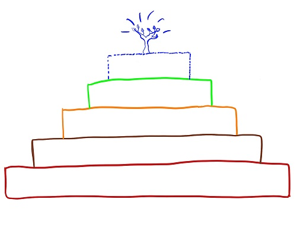
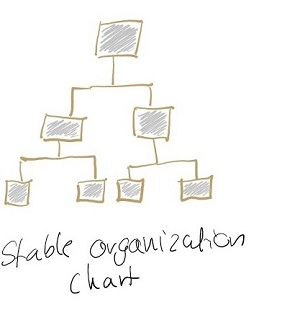
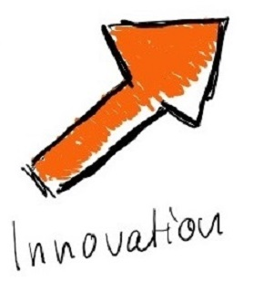

## Reinventing Organizations

>by Carolin Hitzegrad & Kai van de Zand

<!-- .slide: data-transition="linear" -->
---

### Today we want to give you answers to the following questions:

 1. How are organizations run today? /Which worldview do they have?

2. What is a teal organization? 

3. Why is self-management so important?

4. Why should organizations strive for wholeness?
<!-- .slide: data-transition="linear" -->

---

### Today we want to give you answers to the following questions:

5. What is the evolutionary purpose of an organization?

6. How do we get teal structures and purposes into our organization?

7. What are today´s key take-aways?

8. What are our references?

<!-- .slide: data-transition="linear" -->

---

### How are organizations run today? /Which worldview do they have?

>"_The way we run organizations today is broken_"

<!-- .slide: data-transition="linear" -->
---

### How are organizations run today? /Which worldview do they have?
* Employees do not feel engaged at work
* Leaders feel under pressure from never ending streams of e-mails, meetings...
* Costumer's trust and brand loyalty is low

<!-- .slide: data-transition="linear" -->
---

### How are organizations run today? /Which worldview do they have?

<!-- .element height="50%" width="50%" -->

<!-- .slide: data-transition="linear" -->

---

###  **Red (impulsive worldview)**
  > Order from the top is everything
  >>+ No internalized rules
  >>+ Brutal force if needed
  >>+ Power is the way on looking at the world

<!-- .slide: data-transition="linear" -->

---
###  **Red (impulsive worldview)**

Breakthrough (BT) 1             |  Breakthrough (BT) 2
:-------------------------:|:-------------------------:
  |  

<!-- .slide: data-transition="linear" -->
---

###  **Amber (conformist) worldview**
> Everything is about stability and certainty
>>+ Internalized rules and exercise self-discipline
>>+ Guilt and shame as the glue of society
>>+ Clear ranks and first hierarchical pyramids

<!-- .slide: data-transition="linear" -->
---

###  **Amber (conformist) worldview**

BT 1                       |  BT 2
:-------------------------:|:-------------------------:
  |  

<!-- .slide: data-transition="linear" -->
---

### **Orange (achievement) worldview**
> Defined by materialistic obsession & social inequality
>>+ The world is no longer seen as fixed by rules
>>+  Be anyone you want to be
>>+  Achieve anything you set your mind to

<!-- .slide: data-transition="linear" -->
---

### **Orange (achievement) worldview**

BT 1                      |BT 2                      |BT 3          
:------------------------:|:------------------------:|:------------------------:|
||    

<!-- .slide: data-transition="linear" -->

---

### **Green (pluralistic) worldview**
> People are aware of orange’s materialistic obsession
>>+ Happiness is important to the organization’s overall success
>>+ Organization as families
>>+ Aspires to be egalitarian and consensus seeking

<!-- .slide: data-transition="linear" -->
---

### **Green (pluralistic) worldview**
BT 1                      |BT 2                      |BT 3          
:------------------------:|:------------------------:|:------------------------:|
||

<!-- .slide: data-transition="linear" -->
---

### **What now?**
<!-- .element height="130%" width="130%" -->

<!-- .slide: data-transition="linear" -->

---
## **Teal Organizations**
* emerging & evolutionary form of organizations
* the world is seen as a place to discover and journey towards one **owns true self**

<!-- .slide: data-transition="linear" -->

---

>All of us have deep yearning for wholeness, reuniting with all of who we are, with all aorund and all forms of life and nature
---
### What is a teal organization?

<!-- .slide: data-transition="linear" -->

---
### What is a teal organization?

<!-- .slide: data-transition="linear" -->
---

### Why is self-management so important?

                        |    
:-------------------------:|:-------------------------:
| Bye bye Hierarchy - Hello collective intelligence

<!-- .slide: data-transition="linear" -->
---

### Why is self-management so important?

#### 3 Missunderstandings with self-management
1. Self-management means that there is **no structure**, that everything is **informal** and **chaotic**
2. Self-management = consensus decision making = endless meetings
3. Self-management is **experimental** and **unproven**

<!-- .slide: data-transition="linear" -->
---
### Why is self-management so important?
##### Organizational Structure 
<!-- .element height="70%" width="70%" -->

<!-- .slide: data-transition="linear" -->
---

### Why is self-management so important?
##### Decision-Making
<!-- .element height="50%" width="50%" -->

<!-- .slide: data-transition="linear" -->
---
### Why is self-management so important?
##### Is it really unproven?
                        |    
:-------------------------:|:-------------------------:
| 
<!-- .slide: data-transition="linear" -->

---

### Breakthrough 2 - Striving for Wholeness

<!-- .slide: data-transition="none" -->
---
### Breakthrough 2 - Striving for Wholeness

<!-- .slide: data-transition="none" -->
---
### Breakthrough 2 - Striving for Wholeness
<table class=”daTable”>
<tr>
<th>ego</th>
<th>deeper self</th>
</tr>
<tr>
<td>more accepted</td>
<td>showing makes us feel exposed</td>
</tr>
<tr>
<td>masculine vs. feminine</td>
<td></td>
</tr>
</table>
<!-- .slide: data-transition="linear" -->

---
### Breakthrough 2 - Striving for Wholeness

 Company examples:

* Morningstar and FAVI -> self-management
* work can give opportunities to discover new parts of ourselves through the friction of working with others 
    * creates vibrance and aliveness
> "Here I can be myself"
<!-- .slide: data-transition="linear" -->

---
### Breakthrough 2 - Striving for Wholeness

 Meetings:

* self-managing organizations tend to have less
* Buurtzorg: integrative decision making process in holocracy
* FAVI: share your story!
* Heiligenfeld: tingsha bells
<!-- .slide: data-transition="linear" -->

---
### Breakthrough 2 - Striving for Wholeness

 Commitment:

* Buurtzorg
<!-- .slide: data-transition="linear" -->

---
### Breakthrough 2 - Striving for Wholeness

 Performance evaluation:

* 
<!-- .slide: data-transition="linear" -->

---
### What is the evolutionary purpose of an organization?

<table class=”daTable”>
<tr>
<th>Noble Purpose</th>
<th>Evolutionary Purpose</th>
</tr>
<tr>
<td>organization truly takes its purpose seriously</td>
<td>organization listens and dances with that purpose</td>
</tr>
</table>

<!-- .slide: data-transition="linear" -->
---
### What is the evolutionary purpose of an organization?
####	**Predict-and-Control** 

<!-- .slide: data-transition="linear" -->
---
### What is the evolutionary purpose of an organization?
####	**Sense-and-Respond** 
>	We are **present** and with all our **senses fully in play**, we take lots of **input** , consciously and unconsciously, and we **continuously adjust to reality**

<!-- .slide: data-transition="linear" -->
---

### What is the evolutionary purpose of an organization?
+ Teal Organizations **do not have fixed budgets**
    + all the units are asked to **submit the numbers of what they need**: that is the budget
+ In teal organizations you **do not need to impose change**  from the outside
    + innate capacity to **sense changes** in their environment and to **adapt** from within

<!-- .slide: data-transition="linear" -->
---

## test

<!-- .slide: data-background="./agenda.jpg" 
data-background-size="100px" data-background-repeat="repeat" data-background-color="#111" -->

---

<section data-background="agenda.jpg" data-state="img-right"> 
    // # test 
</section> 