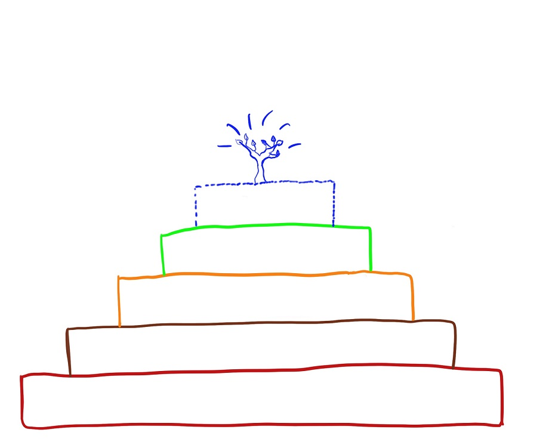

## Reinventing Organizations

>by Carolin Hitzegrad & Kai van de Zand
---

### Today we want to give you answers to the following questions:
1. How are organizations run today? /Which worldview do they have?
1. 2. What is a teal organization?
2. Why is self-management so important?
3. Why should organizations strive for wholeness?
4. What is the evolutionary purpose of an organization?
5. How do we get teal structures and purposes into our organization?
6. What are today´s Key take-aways?

---

8. What are our references What are our references

---

### How are organizations run today? /Which worldview do they have?

>"_The way we run organizations today is broken_"

---

### How are organizations run today? /Which worldview do they have?
* Red
* Amber
* Orange
* Green

---

### From Red to Amber

---

### From Amber to Orange

## Teal Organizations
* emerging & evolutionary form of organizations
* the world is seen as a place to discover and journey towards one **owns true self**

---

>All of us have deep yearning for wholeness, reuniting with all of who we are, with all aorund and all forms of life and nature
---
### What is a teal organization?

---
### What is a teal organization?

---

# Breakthrough 1 - Self-Management

> Bye bye Hierarchy - Hello collective intelligence

## Organizational Structure 

## Decision-Making

---

## Perfromance Management

---

## Compensation and incentitives

---

# Breakthrough 2 - Striving for Wholeness

# Breakthrough 3 - Evolutionary purpose

---

## Budgets

---

## Change Management

---

## Final remarks

