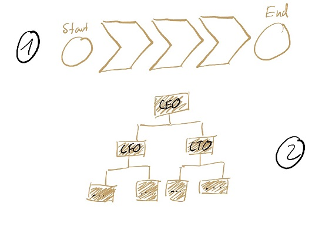

<!-- background: #c8e4f6 -->
<!-- color: #15025e -->
<!-- font: brandon -->

## Reinventing Organizations

>by Carolin Hitzegrad & Kai van de Zand

<!-- .slide: data-transition="linear" -->

---

### Today we want to give you answers to the following questions:

 1. How are organizations run today? /Which worldview do they have?

2. What is a teal organization? 

3. Why is self-management so important?

4. Why should organizations strive for wholeness?
<!-- .slide: data-transition="linear" -->

---

### Today we want to give you answers to the following questions:

5. What is the evolutionary purpose of an organization?

6. How do we get teal structures and purposes into our organization?

7. What are today´s Key take-aways?

8. What are our References?

<!-- .slide: data-transition="linear" -->

---

### How are organizations run today? /Which worldview do they have?

>"_The way we run organizations today is broken_"

<!-- .slide: data-transition="linear" -->

---

### How are organizations run today? /Which worldview do they have?

<!-- .element height="50%" width="50%" -->

<!-- .slide: data-transition="linear" -->

---

###  **Red (impulsive worldview)**
  + Order from the top is everything
  + **"Mafia Lifestyle"**
  + Brutal force if needed

<!-- .slide: data-transition="linear" -->

---

###  **From Red to Amber**

<!-- .slide: data-transition="linear" -->

---

### **From Amber to Orange**

<!-- .slide: data-transition="linear" -->

---
## **Teal Organizations**
* emerging & evolutionary form of organizations
* the world is seen as a place to discover and journey towards one **owns true self**

<!-- .slide: data-transition="linear" -->

---

>All of us have deep yearning for wholeness, reuniting with all of who we are, with all aorund and all forms of life and nature
---
### What is a teal organization?

---
### What is a teal organization?

---

# Breakthrough 1 - Self-Management

> Bye bye Hierarchy - Hello collective intelligence

## Organizational Structure 

## Decision-Making

---

## Perfromance Management

---

## Compensation and incentitives

---

# Breakthrough 2 - Striving for Wholeness

# Breakthrough 3 - Evolutionary purpose

---

## Budgets

---

## Change Management

---

## Final remarks

