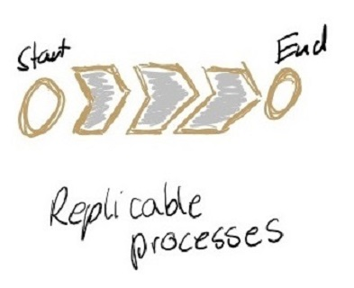
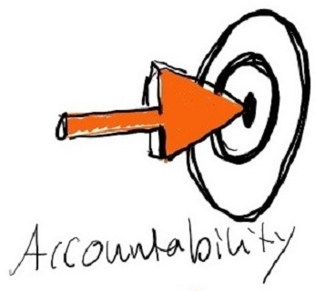
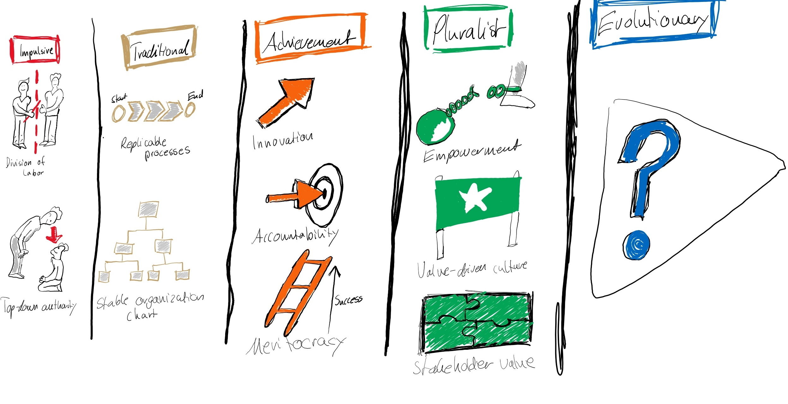
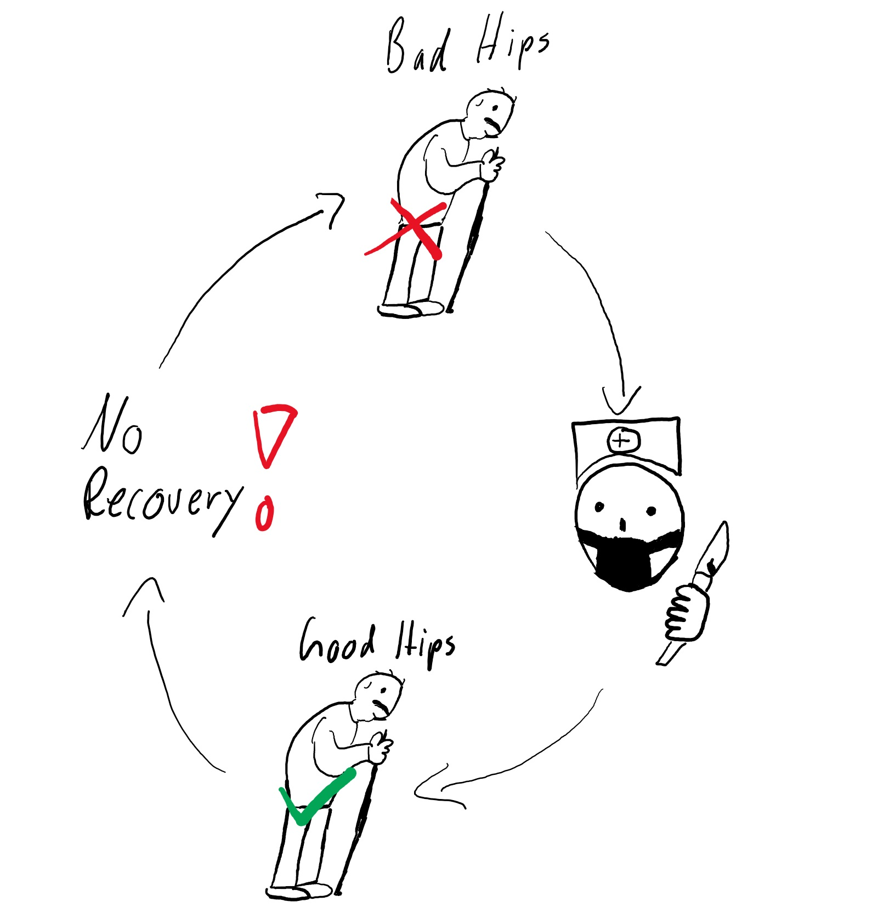

## Reinventing Organizations

<!-- .element height="40%" width="40%" -->
>by Carolin Hitzegrad & Kai van de Zand

<!-- .slide: data-transition="linear" -->
---

### Today we want to give you answers to the following questions:

 1. How are organizations run today? /Which worldview do they have?

2. What is a teal organization? 

3. Why is self-management so important?

4. Why should organizations strive for wholeness?
<!-- .slide: data-transition="linear" -->

---

### Today we want to give you answers to the following questions:

5. What is the evolutionary purpose of an organization?

6. How do we get teal structures and purposes into our organization?

7. What are today´s key take-aways?

8. What are our references?

<!-- .slide: data-transition="linear" -->

---
<!-- .slide: data-background="./structure1.jpg" -->
### How are organizations run today? /Which worldview do they have?

>"_The way we run organizations today is broken_"

<!-- .slide: data-transition="linear" -->
---
<!-- .slide: data-background="./structure1.jpg" -->
### How are organizations run today? /Which worldview do they have?
* Employees do not feel engaged at work
* Leaders feel under pressure from never ending streams of e-mails, meetings...
* Costumer's trust and brand loyalty is low

<!-- .slide: data-transition="linear" -->
---
<!-- .slide: data-background="./structure1.jpg" -->
### How are organizations run today? /Which worldview do they have?

<!-- .element height="50%" width="50%" -->

<!-- .slide: data-transition="linear" -->

---
<!-- .slide: data-background="./structure1.jpg" -->
###  **Red (impulsive worldview)**
  > Order from the top is everything
  + No internalized rules
  + Brutal force if needed
  + Power is the way on looking at the world

<!-- .slide: data-transition="linear" -->

---
<!-- .slide: data-background="./structure1.jpg" -->
 **.**
###  **Red (impulsive worldview)**

Breakthrough (BT) 1             |  Breakthrough (BT) 2
:-------------------------:|:-------------------------:
  |  

<!-- .slide: data-transition="linear" -->
---
<!-- .slide: data-background="./structure1.jpg" -->
 **.**
###  **Amber (conformist) worldview**
> Everything is about stability and certainty
+ Internalized rules 
+ Guilt and shame as the glue of society
+ Clear ranks and first hierarchical pyramids

<!-- .slide: data-transition="linear" -->
---
<!-- .slide: data-background="./structure1.jpg" -->
###  **Amber (conformist) worldview**

BT 1                       |  BT 2
:-------------------------:|:-------------------------:
  |  

<!-- .slide: data-transition="linear" -->
---
<!-- .slide: data-background="./structure1.jpg" -->
 **.**
### **Orange (achievement) worldview**
> Defined by materialistic obsession & social inequality
+ The world is no longer fixed by rules
+  Be anyone you want to be
+  Achieve anything you set your mind to

<!-- .slide: data-transition="linear" -->
---
<!-- .slide: data-background="./structure1.jpg" -->
### **Orange (achievement) worldview**

BT 1                      |BT 2                      |BT 3          
:------------------------:|:------------------------:|:------------------------:|
||    

<!-- .slide: data-transition="linear" -->

---
<!-- .slide: data-background="./structure1.jpg" -->
 **.**
### **Green (pluralistic) worldview**

> Organization as families
+ Happiness is important to the organization’s overall success
+ Aspires to be egalitarian and consensus seeking
+ Aware of orange’s materialistic obsession

<!-- .slide: data-transition="linear" -->
---
<!-- .slide: data-background="./structure1.jpg" -->
### **Green (pluralistic) worldview**
BT 1                      |BT 2                      |BT 3          
:------------------------:|:------------------------:|:------------------------:|
||

<!-- .slide: data-transition="linear" -->
---
<!-- .slide: data-background="./structure1.jpg" -->
 **.**
### **What now?**
<!-- .element height="130%" width="130%" -->

<!-- .slide: data-transition="linear" -->

---
<!-- .slide: data-background="./structure2.jpg" -->
 **.**

### What is a teal organization  organization?

<!-- .element height="40%" width="40%" -->
<!-- .slide: data-transition="linear" -->

---
<!-- .slide: data-background="./structure2.jpg" -->
## **Teal Organizations**
* emerging & evolutionary form of organizations
* the world is seen as a place to discover and journey towards one **owns true self**

<!-- .slide: data-transition="linear" -->

---
<!-- .slide: data-background="./structure2.jpg" -->

>All of us have deep yearning for wholeness, reuniting with all of who we are, with all aorund and all forms of life and nature

---

<!-- .slide: data-background="./structure2.jpg" -->
### What is a teal organization?

<!-- .slide: data-transition="linear" -->
---
<!-- .slide: data-background="./structure3.jpg" -->
 **.**

### Why is self-management so important?

                        |    
:-------------------------:|:-------------------------:
| Bye bye Hierarchy - Hello collective intelligence

<!-- .slide: data-transition="linear" -->
---
<!-- .slide: data-background="./structure3.jpg" -->
### Why is self-management so important?

#### 3 Missunderstandings with self-management
1. Self-management means that there is **no structure**, that everything is **informal** and **chaotic**
2. Self-management = consensus decision making = endless meetings
3. Self-management is **experimental** and **unproven**

<!-- .slide: data-transition="linear" -->
---
<!-- .slide: data-background="./structure3.jpg" -->
 **.**

### Why is self-management so important?
##### Organizational Structure 
<!-- .element height="55%" width="55%" -->

<!-- .slide: data-transition="linear" -->
---
<!-- .slide: data-background="./structure3.jpg" -->
 **.**

### Why is self-management so important?
##### Decision-Making
<!-- .element height="40%" width="40%" -->

<!-- .slide: data-transition="linear" -->
---
<!-- .slide: data-background="./structure3.jpg" -->
 **.**

### Why is self-management so important?
##### Is it really unproven?
                        |    
:-------------------------:|:-------------------------:
| 
<!-- .slide: data-transition="linear" -->

---
<!-- .slide: data-background="./structure4.jpg" -->
 **.**

### Breakthrough 2 - Striving for Wholeness
<!-- .element height="50%" width="50%" -->
<!-- .slide: data-transition="none" -->
---
<!-- .slide: data-background="./structure4.jpg" -->
 **.**
### Breakthrough 2 - Striving for Wholeness
<!-- .element height="50%" width="50%" -->
<!-- .slide: data-transition="none" -->
---
<!-- .slide: data-background="./structure4.jpg" -->

### Breakthrough 2 - Striving for Wholeness
<table class=”daTable”>
<tr>
<th>ego</th>
<th>deeper self</th>
</tr>
<tr>
<td>more accepted</td>
<td>showing makes us feel exposed</td>
</tr>
<tr>
<td>masculine vs. feminine</td>
<td></td>
</tr>
</table>
<!-- .slide: data-transition="linear" -->

---
<!-- .slide: data-background="./structure4.jpg" -->
 **.**

### Breakthrough 2 - Striving for Wholeness

 Wholeness at the workplace:

* Employees shows only 1/16 of his true self at work
* Opportunity to discover new parts of ourselves 
    * friction of working with others 
    * creates vibrance and aliveness
> "Here I can be myself"
<!-- .slide: data-transition="linear" -->

---
<!-- .slide: data-background="./structure4.jpg" -->
 **.**

### Breakthrough 2 - Striving for Wholeness

 Wholeness at the workplace:

* Dogs at workplace
* Patagonia´s Child Development Center for employee´s children
* Truthful recruiting process without "masks"
> Create safe space for employees

<!-- .slide: data-transition="linear" -->

---

<!-- .slide: data-background="./structure4.jpg" -->
 **.**

### Breakthrough 2 - Striving for Wholeness

 Meetings:

* self-managing organizations tend to have less
* Buurtzorg: integrative decision making process in holocracy
* FAVI: share your story!
* Heiligenfeld: tingsha bells
<!-- .slide: data-transition="linear" -->

---

<!-- .slide: data-background="./structure4.jpg" -->
 **.**

### Breakthrough 2 - Striving for Wholeness

 Commitment:

* (Un)acceptable reasons
* small self-managing team structure supports flexibility
    * Supported by Buurtzorg and FAVI
> you are flexible but you need to fulfill your commitments
<!-- .slide: data-transition="linear" -->

---
<!-- .slide: data-background="./structure4.jpg" -->
 **.**

### Breakthrough 2 - Striving for Wholeness

 Performance evaluation:

* Sounds True method
    * Provoking questions enhances reflection
    * Colleagues convene and give notes afterwards
    > Goal: do not feel judged and share your feedback!
<!-- .slide: data-transition="linear" -->

---

<!-- .slide: data-background="./structure5.jpg" -->
### What is the evolutionary purpose of an organization?

<table class=”daTable”>
<tr>
<th>Purpose</th>
<th>Noble Purpose</th>
<th>Evolutionary Purpose</th>
</tr>
<tr>
<td>Provides guidance and inspiration</td>
<td>Organization truly takes its purpose seriously</td>
<td>Organization listens and dances with that purpose</td>
</tr>
</table>

<!-- .slide: data-transition="linear" -->

---

<!-- .slide: data-background="./structure5.jpg" -->
### What is the evolutionary purpose of an organization?
####	**Predict-and-Control** 

<!-- .slide: data-transition="linear" -->

---

<!-- .slide: data-background="./structure5.jpg" -->
### What is the evolutionary purpose of an organization?
####	**Sense-and-Respond** 
>	We are **present** and with all our **senses fully in play**, we take lots of **input** , consciously and unconsciously, and we **continuously adjust to reality**

<!-- .slide: data-transition="linear" -->

---

<!-- .slide: data-background="./structure5.jpg" -->

### What is the evolutionary purpose of an organization?
+ Teal Organizations **do not have fixed budgets**
    + all the units are asked to **submit the numbers of what they need**: that is the budget
+ In teal organizations you **do not need to impose change**  from the outside
    + innate capacity to **sense changes** in their environment and to **adapt** from within

<!-- .slide: data-transition="linear" -->

---

<!-- .slide: data-background="./structure5.jpg" -->

### What is the evolutionary purpose of an organization?
##### A small example of change
<!-- .element height="40%" width="40%" -->

<!-- .slide: data-transition="linear" -->

---

<!-- .slide: data-background="./structure5.jpg" -->

### What is the evolutionary purpose of an organization?
##### A small example of change

<!-- .slide: data-transition="linear" -->

---
<!-- .slide: data-background="./structure5.jpg" -->

### What is the evolutionary purpose of an organization?
##### A small example of change

<!-- .slide: data-transition="linear" -->

---

<!-- .slide: data-background="./structure6.jpg" -->
### How do we get teal structures and purposes into our organization?
Two necessary conditions:
1. Top leadership
2. Ownership

<!-- .slide: data-transition="linear" -->

---
<!-- .slide: data-background="./structure6.jpg" -->
### How do we get teal structures and purposes into our organization?
> What do you think?\
> Is it easier to start a new teal organization from scratch or to transform an existing one?

<!-- .slide: data-transition="linear" -->

---

<!-- .slide: data-background="./structure6.jpg" -->
 **.**

### How do we get teal structures and purposes into our organization?
> Usually, it is easier to start a teal organization from scratch because you can define how the organization will look like

>But how do we transform an existing organization?

<!-- .slide: data-transition="linear" -->

---
<!-- .slide: data-background="./structure6.jpg" -->
### How do we get teal structures and purposes into our organization?

CEO of FAVI answers:
> There is no one recipe!

* We need to upgrade how we think about change
    * complex vs complicated system

<!-- .slide: data-transition="linear" -->

---
<!-- .slide: data-background="./structure6.jpg" -->
### How do we get teal structures and purposes into our organization?

4 options to start:

<!-- .element height="50%" width="50%" -->

---
<!-- .slide: data-background="./structure6.jpg" -->
### How do we get teal structures and purposes into our organization?
Important to keep in mind:
* Start where the energy is waiting
* Self-correction is powerful
* Role of the CEO changes
    * public face
    * sensor of where the organization will go to

<!-- .slide: data-transition="linear" -->

---

<!-- .slide: data-background="./structure7.jpg" -->

---
<!-- .slide: data-background="./structure8.jpg" -->

---
<!-- .slide: data-background="./structure.jpg" -->
 **.**

KAHOOT!

---
<!-- .slide: data-background="./structure.jpg" -->
 **.**
### test
* slide grün1 braucht noch kleinere schriftgröße
* 
* 
*

---
